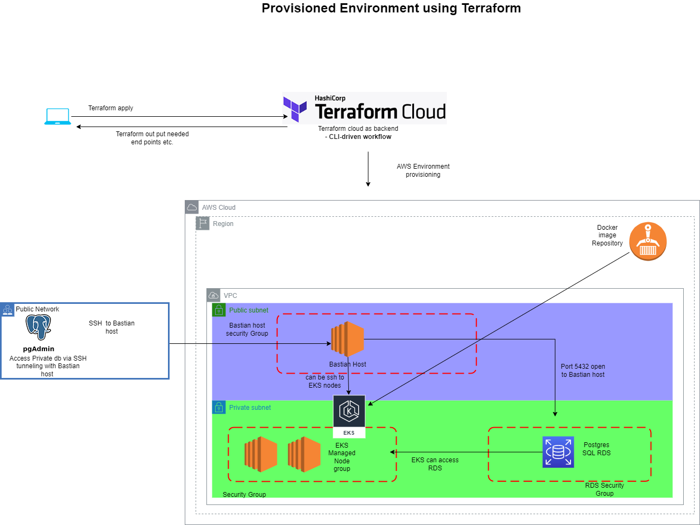
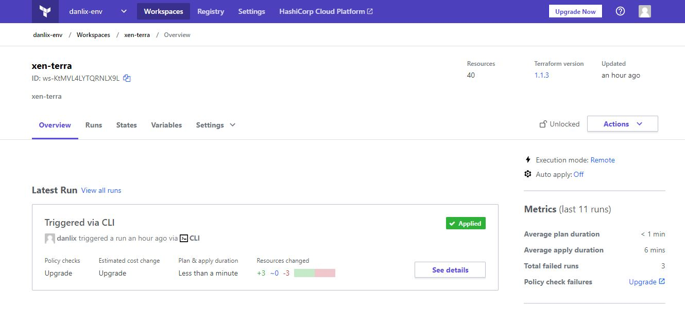

# EKS environment provisioning - Terraform [Terraform Cloud - CLI-driven workflow]

**Services that are going to Created**

- EKS 
- EKS managed node group
- VPC 
- ECR
- IAM policies
- PostgreSQL RDS
- Bastion host
- Security groups 
- SSH key

Here bastion host used because EKS cluster and RDS in private subnet. if users are not in VPN with AWS. have to use bastion host to conenct to RDS or ssh to Cluster if needed.

**Below image shows that AWS environement which is going to create**





# Terraform Setup 

Clone this Repository 

Modify terraform backend file with your Terraform cloud details
File name =  `config.remote.tfbackend`

you will find similar code as follows
```
workspaces { name = "xen-terra" }
hostname     = "app.terraform.io"
organization = "danlix-env"
```


Add below variables to terraform cloud workspace env variables

- AWS_ACCESS_KEY_ID 

- AWS_SECRET_ACCESS_KEY


Terraform cloud



add your ssh public key to `sshkey.tf` file . Then you can ssh to bastion host and EKS nodes using your key

you will have to change region in variables.tf file ( Here I used us-west-2 ) and ubuntu AMI in bastinhost.tf


**Run below commands to env setup**
```
terraform login # use terraform cloud API token to authenticate

terraform init -backend-config=config.remote.tfbackend

terraform validate

terraform plan

terraform apply -auto-approve
```

you will get outputs of ECR,EKS,RDS etc.


**Destroy Environment**
```
terraform destroy -auto-approve 
```
- In AWS console check RDS snapshots and delete it
